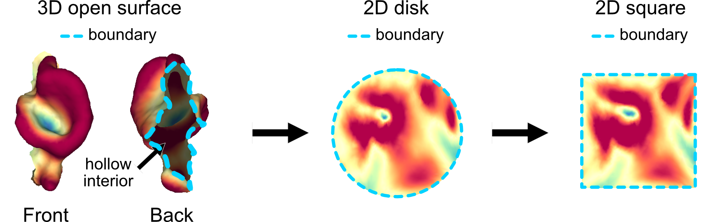

# Unwrapping individual protrusions

If we take all the vertices assigned to an individual protrusion after instance segmentation we can form a separate new submesh whilst retaining the connectivity of the vertices. Such a submesh is an open surface, which unlike closed surface such as a sphere, do not have all faces connected to form a 'watertight' enclosed shaped but instead have an open boundary, and is hollow. An open surface is called <ins>simple</ins> if it contains no holes. A simple open surface is the equivalent of a genus-0 closed shape, and can be mapped conformally to the 2D disk. 

u-Unwrap3D provides functionality to map simple open surfaces to canonical shapes equivalent to the mapping of 3D surfaces to the unit sphere:
1. **2D unit disk**:
    - conformal map : through Poisson equation and quasiconformal maps
    - equiareal map : through area distortion relaxation of the conformal map
2. **2D square**:
    - squaring the 2D disk mapping 
3. **2D rectangle**:
    - from the 2D square mapping after optimization of the aspect-ratio